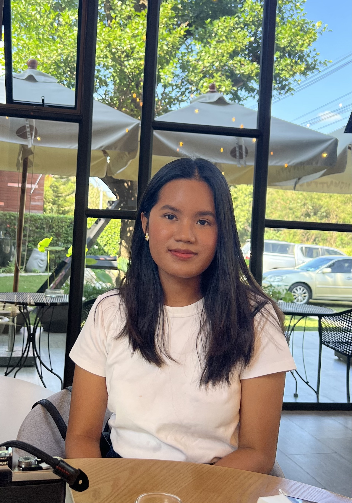

# About me

Hi! I'm Bua (Phrimphissa) Kraikhun, a healthcare analytics and information technology student with a passion for business analytics. My goal is to provide valuable insights, recommendations, and compelling stories using data. I believe that turning complex information into accessible and engaging visuals is the key to data-driven organizational success.

After graduating in electronics and communication engineering, I gained two years of work experience as an analyst in the business development department of a state-owned oil and gas company. As an analyst, I had to utilize various types of visualizations to effectively communicate study results and recommend courses of action to decision-makers and stakeholders. The most crucial aspect I considered when creating the right visualizations was understanding the audience - who they are and what they are seeking. 

In my journey as a healthcare analytics and IT student with a background in business development analysis, I'm excited to combine my skills and passion to drive data-driven innovation and empower organizations to make informed decisions.

# Portfolio
This is my public portfolio for Telling Stories with Data at CMU! 

## Assignment 1: 
Place holder for assignments description

## Assignment 3&4: 
Place holder for assignments description

## Final project
Place holder for final project description

# What I hope to learn

- Tools that will help me transform, visualize and uncover the insights of the data
- Make visualization that best benefits my audiences
- Provide and take constructive feedback and critiques

