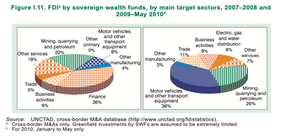
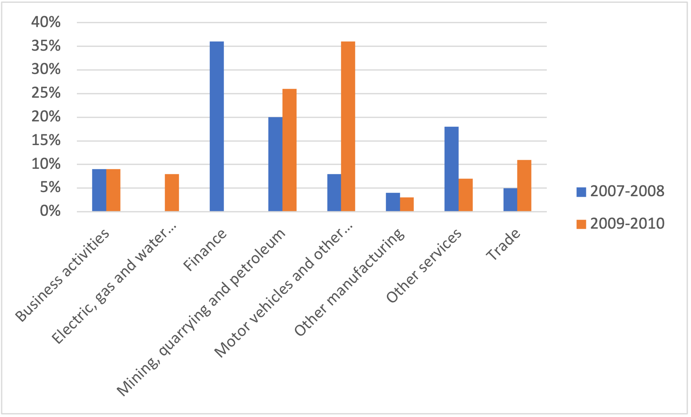
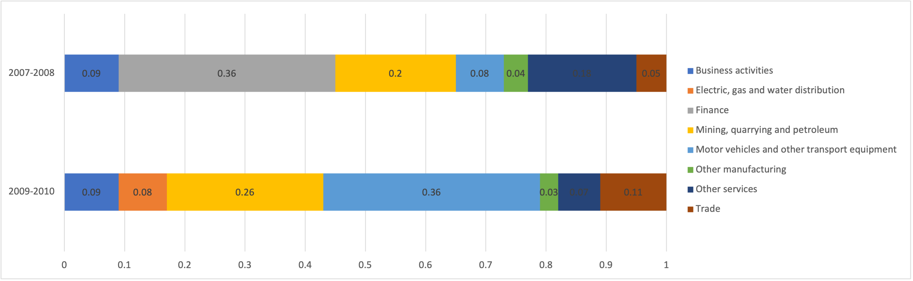
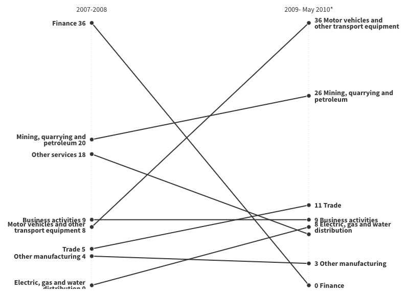

| [home page](https://cmustudent.github.io/tswd-portfolio-templates/) | [visualizing debt](visualizing-government-debt) | [critique by design](critique-by-design) | [final project I](final-project-part-one) | [final project II](final-project-part-two) | [final project III](final-project-part-three) |

# World Investment Report 2010

## Part I:
World Investment Report 2010

## Part II: Critique the data visualization
-	Usefulness: 10 – The data provides information on percentage of sovereign wealth fund investment in each sector for two period reflecting the changes in proportion of the investment. 
-	Completeness: 10 – The visualization includes the right amount of data. The goal is to see changes in proportion of the FDI in two time periods. Therefore, data in level of percentage of each category is appropriate. 
-	Perceptibility: 5 – the color along with pattern used in the chart is distracting. Without looking at the value label, pie chart area is difficult to grasp. The additional 3D effect makes it even harder to compare each category of investment. Even though color and texture is used to differentiate between sectors, the position of each piece changes which takes more eye travel for audiences to notice changes. In short, looking at the pie charts, audiences do not get the message they are trying to convey right away.
-	Truthfulness: 6 – The title and footnote also make it clear that information in 2010 only available up to May. Additionally, footnote also mentions the assumption used in the calculation which makes it clear to the audience. However, the point is deducted here for the 3D effect that makes some pieces look unproportionally bigger than the other with similar value. For example, mining, quarrying and petroleum in 2009-2010 with value 26% appears much bigger than the same sector with value 20% in 2007-2008. 
-	Intuitiveness: 10 – Pie chart is quite intuitive and easy to understand despite the texture and colors used.
-	Aesthetics: 6 – Texture distracts the audiences from the information presented and choice of color is not aesthetically pleasing. 
-	Engagement: 10 –

## Part III: 
I started with bar chart as it could reduce the eye travel when comparing the different between FDI in two period. The clustered vertical bar chart with color as year indicator is a good candidate, but there are some sectors which started off very high and went to 0 (i.e. Finance). The bar chart does not highlight this fact which can be a disadvantage in conveying the message. 

The next candidate for visualizing this information is the stacked horizontal bar chart. Both bars have the same length making it easier to understand that the changes are in the proportion of each sector. The color also helps to point out the same category to compare. However, the reader has to go to the legend on the right to read out the sector name and the chart is still cannot highlight the change from 36% in finance sector to 0. 

Finally, I picked the slope chart as the visualization of choice. As can be seen from the slope chart below, it is intuitive in terms of changes from period 2007-2008 to 2009-May2010. The draft here still needs color adjustment to highlight the sharp decrease of “finance” sector and the increase in “Mining, quarrying and petroleum” and “Motor vehicles and ither transport equipment”. 

## Part IV:

