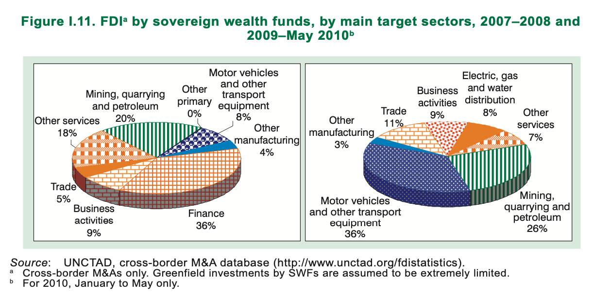

| [home page](https://pkraikhun.github.io/tswd-portfolio-pkraikhu/) | [visualizing debt](visualizing-government-debt) | [critique by design](critique-by-design) | [final project I] | [final project II] | [final project III] |

# World Investment Report 2010

## Part I:
World Investment Report 2010

## Part II: Critique the data visualization
-	Usefulness: 10 – The data provides information on percentage of sovereign wealth fund investment in each sector for two period reflecting the changes in proportion of the investment. 
-	Completeness: 10 – The visualization includes the right amount of data. The goal is to see changes in proportion of the FDI in two time periods. Therefore, data in level of percentage of each category is appropriate. 
-	Perceptibility: 5 – the color along with pattern used in the chart is distracting. Without looking at the value label, pie chart area is difficult to grasp. The additional 3D effect makes it even harder to compare each category of investment. Even though color and texture is used to differentiate between sectors, the position of each piece changes which takes more eye travel for audiences to notice changes. In short, looking at the pie charts, audiences do not get the message they are trying to convey right away.
-	Truthfulness: 6 – The title and footnote also make it clear that information in 2010 only available up to May. Additionally, footnote also mentions the assumption used in the calculation which makes it clear to the audience. However, the point is deducted here for the 3D effect that makes some pieces look unproportionally bigger than the other with similar value. For example, mining, quarrying and petroleum in 2009-2010 with value 26% appears much bigger than the same sector with value 20% in 2007-2008. 
-	Intuitiveness: 10 – Pie chart is quite intuitive and easy to understand despite the texture and colors used.
-	Aesthetics: 4 – The choice of color as well as the texture is not aesthetically pleasing.
-	Engagement: 6 – Texture distracts the audiences from the information presented. However, the audiences can still see and understand the data.

## Part III: Sketch out a solution
I started with bar chart as it could reduce the eye travel when comparing the different between FDI in two period. The clustered vertical bar chart with color as year indicator is a good candidate, but there are some sectors which started off very high and went to 0 (i.e. Finance). The bar chart does not highlight this fact which can be a disadvantage in conveying the message. 

The next candidate for visualizing this information is the stacked horizontal bar chart. Both bars have the same length making it easier to understand that the changes are in the proportion of each sector. The color also helps to point out the same category to compare. However, the reader has to go to the legend on the right to read out the sector name and the chart is still cannot highlight the change from 36% in finance sector to 0. 

Finally, I picked the slope chart as the visualization of choice. As can be seen from the slope chart below, it is intuitive in terms of changes from period 2007-2008 to 2009-May2010. The draft here still needs color adjustment to highlight the sharp decrease of “finance” sector and the increase in “Mining, quarrying and petroleum” and “Motor vehicles and ither transport equipment”. 

## Part IV: Test the solution

The visualization is shown to two friends who provide me with their critique on the chart.

Friend 1: It took her sometime to figure out the meaning of the topic as she does not have expertise in economics, particularly the accronym. After some context about the SWD and FDI, she thought the chart highlight the information on the change well. However, it took her a while to notice the year lable of the axis. She also mentioned that the slope chart was not very familiar to her. Apart from that, she had some comment on the shades of color green that is used to differentiate the chart. It was too dark and appered more black. She also recommended adjusting the size of the sector legend.

Friend 2: She also faced the same problem of not understanding the SWD and FDI concept. She recommended adding subtitle to provide more clarity. She mentioned that the visualizaion aligns with the normal eye-travel pattern - from left to right. With label on the right hand side makes it not redundance. However, she expressed concern as using green-red color pair not only symbolize increase-decrease, but also good-bad. Hence, it would be better to pick some color that does not provide that impression. Additionally, the shade of grey used is also a little bit too dark making the whole visualization seems busy.

## Part V: Build your solution

The final visualization is revised according feedback and critiques. The color scheme used is blue-orange which is more neutral than green-red which could imply the good/bad meaning. Additionaly, the color of other lines are adjusted so that it wouldn't be distracting to the reader. The full information is also available as a pop-up text box. Apart from that, the title is adjusted to reflect the information presented and subtitle is added to provide more context to the reader. This way, the visualization could stand on its own without much context, unlike the original one which accompanied by a paragraph of text. The subtitle is cited from the original report to ensure the accuracy of the analysis. Overall, the slope chart captures the change in proportion of FDI that SWF made over two periods well. With the use of colors (blue-orange and grey), the information stands out making it easier for the reader to grasp the message that the visualization is trying to convey. 

