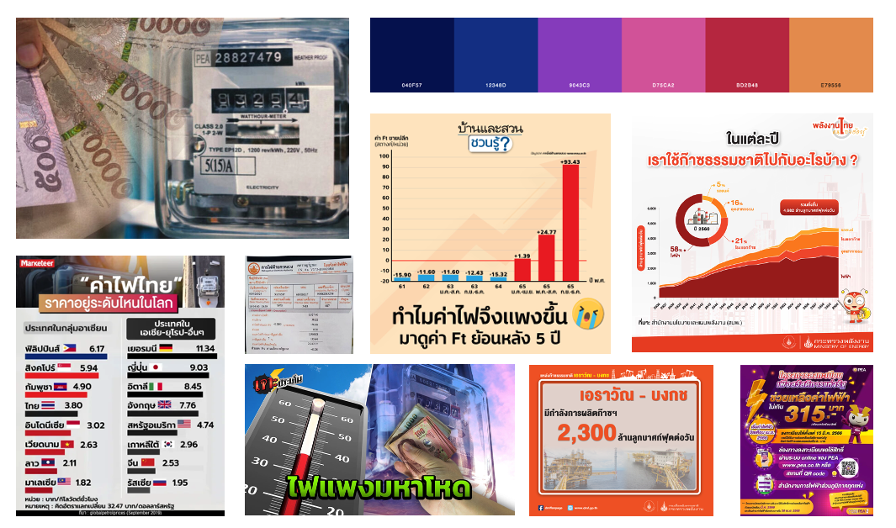

| [home page](https://cmustudent.github.io/tswd-portfolio-templates/) | [visualizing debt](visualizing-government-debt) | [critique by design](critique-by-design) | [final project I](final-project-part-one) | [final project II](final-project-part-two) | final project III |

# Wireframes / storyboards
The story is drafted in Shorthand as shown below. The full page can also be accessed by [link](https://carnegiemellon.shorthandstories.com/unpacking-the-surge/index.html). As per the outline in the part one deliverable, the story tarted with introducing the electricity price components. Then, the variable rate (FT) which is the source of the rise will be discussed. After that, depleting domestic natural gas production is identified as the causes of the rise in FT. The story is followed by the impact it has on the economics. Finally, the call to action would be awareness and support in shifting to more sustainable sources.

# User research 

## Target audience
This story is aimed at the general population in Thailand, with the goal of providing information about the factors contributing to high electricity prices and raising awareness of the shift towards more renewable energy sources. Representative individuals have been selected from diverse educational backgrounds, occupations, and age groups to provide feedback on the storyboard, as the target audience is quite diverse. 

## Interview script

Text here!

| Goal | Questions to Ask |
|------|------------------|
|   Storyline   |            Is the story compelling?      |
|  Identify missing information    |         there other information you would like to know regarding the topic?          |
|   Check for clarity   |           Are the visualizations clear and easy to understand?       |
|  Identify misleading points  |  Is there anything you find surprising or confusing?  |
|  Broaden the perspective and get ideas  |  Is there anything you would change or do differently?  |

Text here!

## Interview findings

Three persons are interviewed as target audience representatives. They are in different age groups and work/study in different fields to represent the diverse group of audiences.

| Questions               | Interview 1 (briefly describe) | Interview 2 | Interview 3 |
|-------------------------|--------------------------------|-------------|-------------|
| Is the story compelling? |Yes, the topic itself is relatable and each items are clearly discussed.           |   Neutral, still not responsible for the bills. After going through a story, quite interesting. |   Informative, not very convincing. It provides clear information well with nice graphics and color theme.|
| Is there other information you would like to know regarding the topic?                        |    It would be better to provide more context on the renewable energy to make people see the potential benefits. For example, the cost.                               |    Like the price break down because no basic.        |  None. The information is complete.           |
|   Are the visualizations clear and easy to understand?                      |   FT chart: y-axis unit is unclear, Domestic ng: title is not clear, Total NG: y-axis unit        |    Domestic NG: unclear what is the unit of the value         |  Yes. Recommend bigger axis labels           |
| Is there anything you find surprising or confusing? | Surprised at the jump in FT price and the drop in domestic NG | The high jump in FT. | The drop in domestic natural gas supply is surprising. |
Is there anything you would change or do differently? | The transition between section is a little bit off | The jump to last page is quite sudden. Add more information on renewable energy could help.| Add more connection to the last page. | 

# Identified changes for Part III

Based on the results of the interview, it is evident that certain modifications are required to enhance the narratives and guarantee improved clarity.

| Research synthesis                       | Anticipated changes for Part III                                                |
|------------------------------------------|---------------------------------------------------------------------------------|
| Findings or observations from interviews | Domestic NG supply chart: change title to Percent Decline in Domestic Natural Gas Production from the peak in 2014 (%)  |
| The font size in charts shows up quite small on Shorthand | Increase the chart axis label size        |
| FT Chart is a bit vague. Without the unit, people might assume that it is THB. |  add unit to the legend (/100 THB)  |
| There is not much relevance moving from the impact of high electricity cost to the call to action | Add a new section showing cost different for each source of electricity |

Overall, the storyboard is quite appealing and compelling. Nonetheless, there are some specific details that require adjustment, particularly in the transition leading to the call to action. It would be beneficial for the audience to have access to additional information regarding the production costs of various types of renewable energy, allowing for a more compelling narrative through comparisons.

# Moodboards / personas
The color scheme used on similar topics is mostly red/ orange to show the sense of urgency and negative impact. The story also features images of money and the electricity bills.

